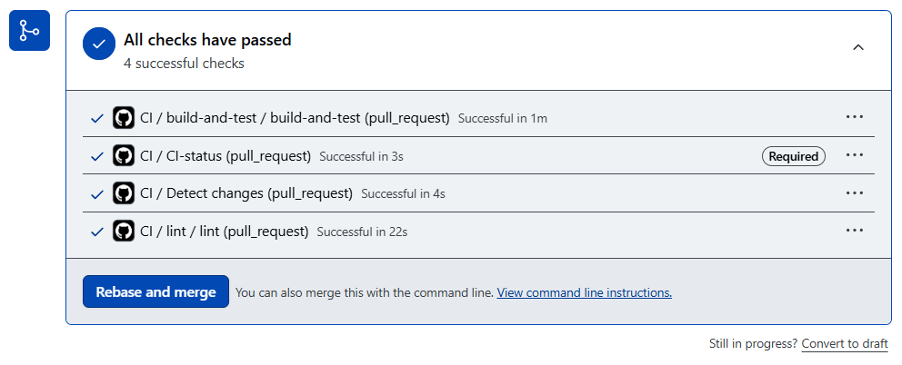
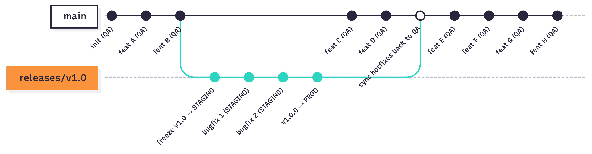
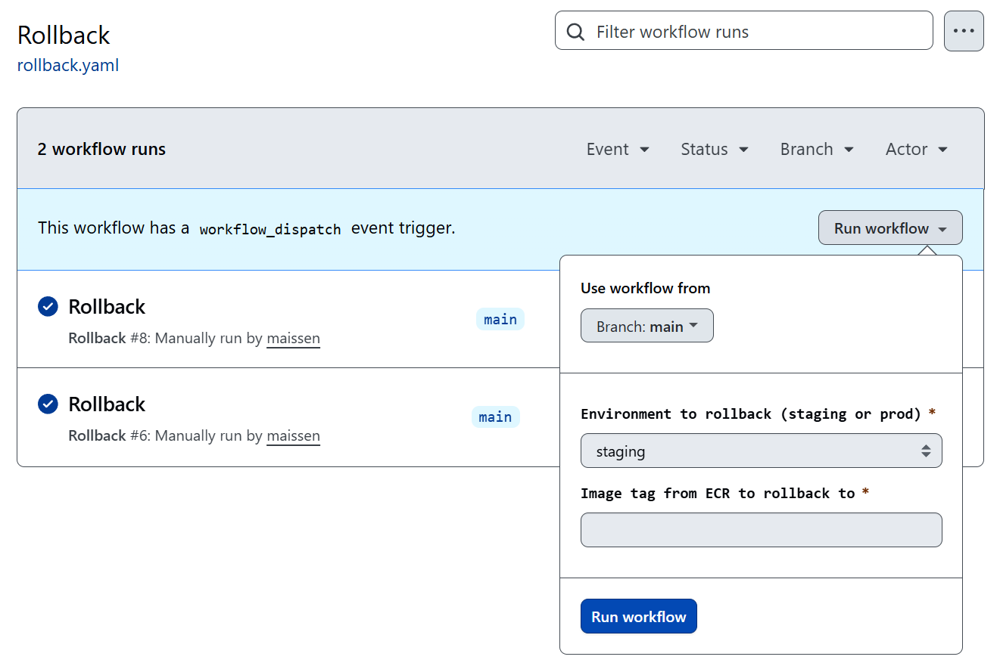

# URL Shortener Backend

A Flask REST API that creates, resolves, and tracks shortened URLs. Built with Python 3.11, Flask, and AWS DynamoDB as the backing store. The application is containerised with Docker and deployed to AWS ECS Fargate. This repository covers the application layer only, infrastructure lives in the [infrastructure repo](https://github.com/maissen/url-shortener-infra).

---

## API Reference

### `GET /health`

Liveness and readiness probe. Verifies DynamoDB connectivity before returning `ok`, the orchestrator uses this to route traffic away from a degraded instance.

**Response 200**
```json
{
  "status": "ok",
  "env": "production"
}
```

**Response 500** (DynamoDB unreachable)
```json
{ "status": "degraded", "reason": "..." }
```

```bash
curl https://maissen.tech/health
```

---

### `POST /shorten`

Create a short URL. Generates a 7-character alphanumeric code and writes it to DynamoDB.

**Request body**
```json
{ "url": "https://example.com/very/long/path" }
```

`url` must start with `http://` or `https://`. Any other scheme returns `422`.

**Response 201**
```json
{
  "code": "a3f9b21",
  "short_url": "https://maissen.tech/a3f9b21"
}
```

```bash
curl -X POST https://maissen.tech/shorten \
  -H "Content-Type: application/json" \
  -d '{"url": "https://example.com/very/long/path"}'
```

---

### `GET /<code>`

Redirect to the original URL. Atomically increments the click counter and issues a `301`.

**Response 301** : `Location` header set to the original URL

**Response 404** : code does not exist or is malformed (must match `[0-9a-zA-Z]{7}`)

```bash
curl -L https://maissen.tech/a3f9b21
```

---

### `GET /stats/<code>`

Return metadata and click count for a short code.

**Response 200**
```json
{
  "code": "a3f9b21",
  "original_url": "https://example.com/very/long/path",
  "created_at": 1713000000,
  "click_count": 42,
  "short_url": "https://maissen.tech/a3f9b21"
}
```

```bash
curl https://maissen.tech/stats/a3f9b21
```

---

### `GET /urls`

List all shortened URLs. Paginated via DynamoDB scan.

**Query parameters**

| Parameter | Default | Description |
|-----------|---------|-------------|
| `limit` | `50` | Items per page. Clamped to `[1, 100]`. |
| `cursor` | "" | Opaque pagination token from a previous response's `cursor` field. |

**Response 200**
```json
{
  "items": [
    {
      "code": "a3f9b21",
      "original_url": "https://example.com/...",
      "created_at": 1713000000,
      "click_count": 42,
      "short_url": "https://maissen.tech/a3f9b21"
    }
  ],
  "cursor": "<opaque token or null>"
}
```

```bash
# First page
curl "https://maissen.tech/urls?limit=20"

# Next page
curl "https://maissen.tech/urls?limit=20&cursor=<token>"
```

---

### `DELETE /<code>`

Delete a short URL entry. Returns `404` if the code does not exist.

**Response 200**
```json
{ "deleted": true, "code": "a3f9b21" }
```

```bash
curl -X DELETE https://maissen.tech/a3f9b21
```

---

## Local Development

Requirements: Docker and Docker Compose. No AWS account needed, DynamoDB Local runs as a sidecar container.

**1. Clone the repo and copy the environment file**

```bash
git clone https://github.com/maissen/url-shortener-backend
cd url-shortener-backend
cp .env.example .env   # edit if needed, defaults work out of the box
```

**2. Start all services**

```bash
docker compose up --build
```

This starts three containers in order: `dynamo` (DynamoDB Local on port 8000), `dynamo-init` (creates the table and exits), and `api` (Flask/gunicorn on the port set by `PORT` env variable).

**3. Confirm the API is running**

```bash
curl http://localhost/health
# {"status": "ok", ...}
```


**4. Create and resolve a short URL**

```bash
# Shorten
curl -X POST http://localhost/shorten \
  -H "Content-Type: application/json" \
  -d '{"url": "https://example.com"}'

# Redirect (follow the 301)
curl -L http://localhost/<code>
```

**Stopping and cleaning up**

```bash
docker compose down -v   # -v removes the dynamo_data volume
```

---

## Environment Variables

All variables are read at startup. In production, `DYNAMODB_TABLE` is resolved from SSM Parameter Store at path `/yourapp/{APP_ENV}/dynamodb_table_name`; the env var serves as a local fallback only.

| Variable | Required | Source | Description |
|----------|----------|--------|-------------|
| `APP_ENV` | No | `.env` / ECS task | Runtime environment: `development` or `production`. Controls log level and debug mode. Default: `production`. |
| `PORT` | No | `.env` / ECS task | Port the container listens on. Default: `3000`. |
| `AWS_REGION` | No | `.env` / ECS task | AWS region for DynamoDB and SSM clients. Default: `us-east-1`. |
| `BASE_URL` | **Yes** | `.env` / ECS task | Public base URL prepended to short codes in responses. Example: `https://maissen.tech`. |
| `DYNAMODB_TABLE` | No | `.env` only | DynamoDB table name. Used locally when SSM is unavailable. Default: `url-shortener`. |
| `AWS_ENDPOINT_URL_DYNAMODB` | No | `docker-compose.yml` | Override the DynamoDB endpoint. Set to `http://dynamo:8000` for local development. Not used in production. |

---

## CI/CD



The application pipeline runs entirely in GitHub Actions. Workflows live in `.github/workflows/`.

**On pull request to `main`**

`ci.yaml` runs a path-based change detection step first, then conditionally calls two reusable workflows. `lint.yaml` runs `pre-commit` with ruff (formatting + linting), yamllint, and hadolint against all files. `build-and-test.yaml` builds the Docker image, installs Python dependencies, runs the test suite with `pytest`, and then runs a Trivy scan against the built image, failing the build on any unfixed `CRITICAL` or `HIGH` CVE. A final `CI-status` job aggregates the results and gates the merge.

**On merge to `main`** (and on `releases/v*` pushes and published releases)

`cd.yaml` builds and pushes the image to ECR, renders the ECS task definition with the new image, and deploys to the target environment. See the [infrastructure repo](https://github.com/maissen/url-shortener-infra) for the environment promotion flow, manual approval gates, and production deployment configuration.

---

## Testing

Tests are in `test_app.py` and use `pytest` with `unittest.mock` to patch all AWS calls, no live AWS credentials or DynamoDB instance required.

**Run tests locally**

```bash
pip install -r requirements.txt
pytest -v
```

**Run with coverage**

```bash
pytest --cov=app --cov-report=term-missing
```

**What the tests cover**

Every endpoint is tested for happy-path responses, error branches (missing fields, invalid input, DynamoDB failures), HTTP method restrictions, and response body shape. Specific cases include: health degraded when DynamoDB is unreachable, redirect incrementing the click counter via an atomic `UpdateExpression`, `GET /urls` pagination cursor encoding and clamping of the `limit` parameter, and the `X-Request-ID` header being present on all responses.

---

## Image Tagging Strategy

Every image pushed to ECR is tagged with the short git commit SHA (first 8 characters of `GITHUB_SHA`). For `releases/v*` branches the tag is `{version}-{sha}` (e.g. `v1.2.0-a3f9b21c`); for published releases it is the tag name itself (e.g. `v1.2.0`). This makes every deployed image traceable back to a specific commit without relying on `latest`.




The rollback is handled by the `rollback.yaml` workflow. It prompts you to enter the desired image tag from ECR and select the target environment (staging or prod), then redeploys accordingly.

To find available tags:

```bash
aws ecr list-images --repository-name url-shortener --filter tagStatus=TAGGED
```

